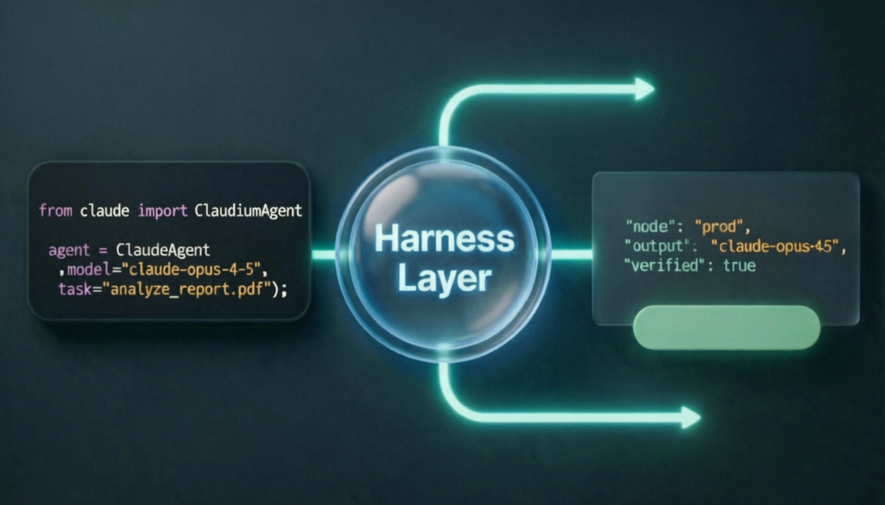
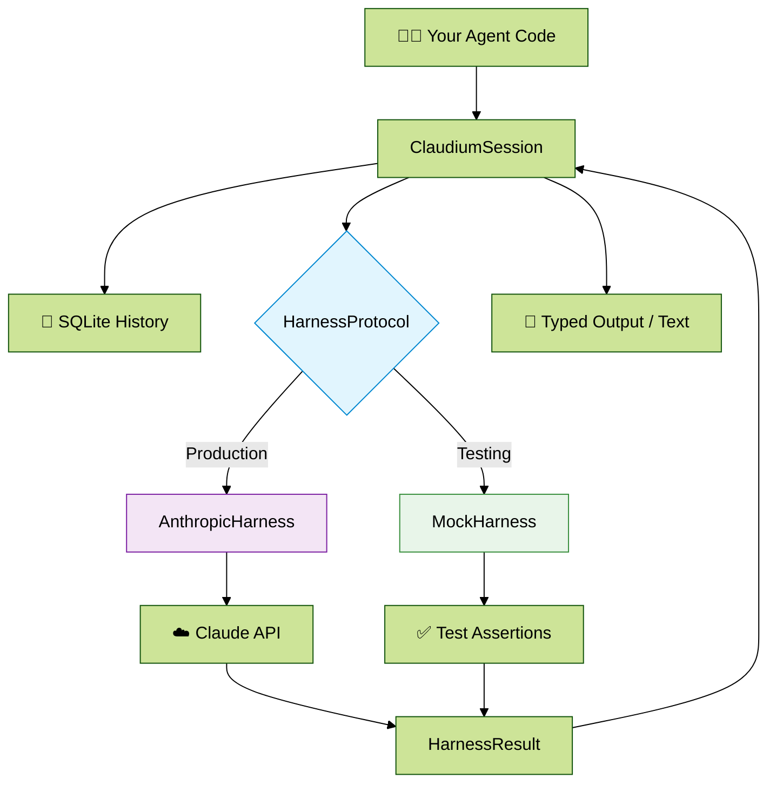

<div align="center">

# Claudium

### The Claude agent framework where your logic never depends on the API.

[](https://github.com/ai-craftsman404/claudium/actions)
[](https://www.python.org/)
[](https://www.anthropic.com/)
[](LICENSE)
[]()

`177 tests` · `zero API calls in CI` · `pip install claudium`

[**Quick Start**](#quick-start) · [**How It Works**](#how-claudium-works) · [**Use Cases**](#use-cases) · [**Agent Teams**](#agent-teams) · [**Roadmap**](#roadmap)



</div>

---

## The Problem Every Agent Developer Hits

You build a Claude-powered agent. It works. Then reality sets in:

- **CI is slow and expensive.** Every test hits the API. 80 tests = 80 round trips = a bill and a wait.
- **Tests are non-deterministic.** Claude responds differently each run. You can't tell if *your code* broke or the model just changed its mind.
- **Your logic is hostage to the API.** You can't test parsing, retries, or typed outputs without a live model response.

Every other Claude framework accepts this as the cost of doing business. **Claudium doesn't.**

---

## How Claudium Works



---

## The Harness — Claudium's Core Differentiator

Claudium places a `HarnessProtocol` between your agent logic and the model. In production it routes to `AnthropicHarness`. In tests you swap in `MockHarness`. **Your agent code never changes.**

```python
from claudium import ClaudiumAgent
from claudium.harness.anthropic import AnthropicHarness
from claudium.types import ClaudiumConfig, HarnessResult

# Production — routes to Claude API with prompt caching
agent = ClaudiumAgent(config=config, harness=AnthropicHarness())

# CI / Tests — zero API calls, instant, fully deterministic
class MockHarness:
    async def run(self, *, prompt, system_prompt, config, **_) -> HarnessResult:
        return HarnessResult(text='{"severity": "high", "labels": ["bug", "auth"]}')

agent = ClaudiumAgent(config=config, harness=MockHarness())

# Identical agent code — regardless of which harness is injected
session = await agent.session("triage")
result  = await session.skill("triage", args={"issue": 42}, result=TriageResult)
```

This is what lets Claudium ship with **177 passing tests and zero API calls in CI.**

---

## Use Cases

Three real scenarios — each showing how the harness changes the game.

---

### 1. GitHub Issue Triage

**The situation:** Your triage bot classifies incoming issues and routes them to the right team. It runs in CI on every push. Without the harness, that's an API call per test — slow, costly, and flaky when Claude's response format drifts.

**Production**

```console
$ claudium run --skill triage --prompt "Issue #142: Login fails on Safari macOS 14"

  Severity  →  high
  Labels    →  bug · browser-compat · auth
  Assignee  →  @auth-team
  Summary   →  Safari SameSite cookie regression affecting macOS 14+
```

```python
result = await session.skill(
    "triage",
    args={"issue_number": 142, "title": "Login fails on Safari macOS 14"},
    result=TriageResult,
)
# TriageResult(severity="high", labels=["bug", "browser-compat", "auth"],
#              assignee="@auth-team", summary="Safari SameSite cookie regression...")
```

**The harness advantage — test the entire pipeline offline**

```python
# Swap in MockHarness — CI runs in milliseconds, zero API cost
harness = MockHarness(responses=[
    '{"severity": "high", "labels": ["bug", "auth"], "assignee": "@auth-team"}'
])
agent = ClaudiumAgent(config=config, harness=harness)

# Identical skill call — tests your parsing, retries, and routing logic
result = await session.skill("triage", args={"issue_number": 142}, result=TriageResult)
assert result.severity == "high"
assert "@auth-team" in result.assignee
# Zero API calls. Runs in < 10ms. Ships with confidence.
```

---

### 2. Automated PR Code Review

**The situation:** You want parallel reviewers — one for security, one for performance. Each must have isolated context so their findings don't bleed into each other. Testing parallel async tasks against a live API is a nightmare.

**Production**

```console
$ claudium run --skill pr-review --prompt "PR #99: OAuth2 refactor + new DB layer"

  [security]     2 findings — SQL injection risk db.py:142 · missing CSRF token
  [performance]  1 finding  — N+1 query in user_loader(), suggest eager load
  [style]        Passed
```

```python
session     = await agent.session("pr-review-99")
security    = await session.task("security",    role="security-analyst")
performance = await session.task("performance", role="perf-analyst")

sec_result  = await security.prompt("Review auth.py for vulnerabilities")
perf_result = await performance.prompt("Review db.py for N+1 query patterns")
# Isolated history per task. Shared sandbox. No cross-contamination.
```

**The harness advantage — test parallel task logic without parallel API calls**

```python
# Each task gets its own canned response — deterministic, isolated, instant
harness = MockHarness(responses=[
    "2 findings — SQL injection risk db.py:142 · missing CSRF token",
    "1 finding  — N+1 query in user_loader(), suggest eager load",
])
agent = ClaudiumAgent(config=config, harness=harness)

session     = await agent.session("pr-review-99")
security    = await session.task("security")
performance = await session.task("performance")

sec_result  = await security.prompt("Review auth.py")
perf_result = await performance.prompt("Review db.py")
assert "SQL injection" in sec_result.text
assert "N+1" in perf_result.text
# Two tasks. Two reviewers. Zero API calls.
```

---

### 3. Persistent Customer Support

**The situation:** Each customer gets a session that remembers every prior interaction. Roles route to the right support tier automatically. Testing stateful, multi-turn conversations against a live API is slow, expensive, and order-dependent.

**Production**

```console
$ claudium run --session customer-7821 --prompt "Still having login issues since Monday"

  Context loaded  →  4 prior messages (login failure first reported 3 days ago)
  Role            →  support-tier1 → escalating to support-tier2
  Response        →  I can see you've been dealing with this since Monday.
                     Let's reset your session tokens — here's exactly how...
```

```python
session  = await agent.session(f"customer-{customer_id}", role="support-tier1")
response = await session.prompt(customer_message)
# Claude recalls the full conversation history automatically.
# Role assigns the right model and persona — no code changes to escalate tiers.
```

**The harness advantage — test multi-turn stateful conversations deterministically**

```python
# Simulate a full multi-turn support conversation — no API, no flakiness
harness = MockHarness(responses=[
    "Thanks for reaching out. Can you describe the issue?",
    "I see — let me escalate this to tier 2.",
    "Issue resolved. Closing ticket.",
])
agent = ClaudiumAgent(config=config, harness=harness)

session = await agent.session("customer-7821", role="support-tier1")
await session.prompt("Login is broken")
await session.prompt("Still broken after reset")
msgs = await session._messages()
assert any("escalate" in c for _, c in msgs)
# Full multi-turn conversation tested. History verified. Zero API calls.
```

---

## Quick Start

```bash
pip install claudium
claudium init my-agent
cd my-agent
claudium run --prompt "Triage issue #42"
```

---

## What You Get

| | Capability | What it means |
|---|---|---|
| 🔁 | **Swappable harness** | Decouple agent logic from the API — test offline, deploy with confidence |
| 📝 | **Markdown skills** | Define reusable agent workflows in `.agents/skills/*.md` — no code required |
| 🔒 | **Secure sandbox** | Filesystem and shell access behind explicit opt-in policy — locked down by default |
| 💾 | **Stateful sessions** | Resume agent context across runs with stable session IDs, SQLite-backed |
| 🧩 | **Child tasks** | Spawn focused sub-agents with isolated history and shared sandbox |
| 🎯 | **Typed outputs** | Return validated Pydantic models via Claude's native tool-use — no delimiter hacks |
| ⚡ | **Prompt caching** | System prompts cached automatically — lower cost, faster responses |
| 🌊 | **Streaming** | First-class streaming via `session.stream()`, CLI, or SSE webhook |
| 🔌 | **MCP integration** | Pass MCP server tools directly into Claude's tool-use layer |
| 🪝 | **Webhook agents** | Expose any agent as `POST /agents/{name}/{agent_id}` with one file |
| 🚀 | **One-command deploy** | Generate Docker, Railway, Fly.io, and Render configs with `claudium build` |

---

## Skills — Reusable Agent Workflows

Skills are Markdown files. Write once, invoke anywhere.

`.agents/skills/triage.md`:

```markdown
---
name: triage
description: Classify a GitHub issue by severity, labels, and assignee
---

You are an expert issue triage agent.

Given an issue number and repository:
1. Classify severity — critical, high, medium, or low
2. Suggest appropriate labels
3. Write a one-sentence summary
4. Suggest an assignee if determinable
```

Invoke it with full type safety:

```python
result = await session.skill(
    "triage",
    args={"issue_number": 42, "repo": "org/repo"},
    result=TriageResult,
)
```

---

## Roles — Smart Model Routing

Route tasks to the right Claude model automatically.

`.agents/roles/analyst.md`:

```markdown
---
name: analyst
model: claude-sonnet-4-5
---

You are a senior technical analyst. Be concise and evidence-based.
```

Assign Haiku to fast tasks, Sonnet to standard work, Opus to deep reasoning — all in configuration, zero code changes.

---

## Sessions — Stateful by Default

Every session persists conversation history automatically.

```python
# Day 1
session = await agent.session("customer-42")
await session.prompt("The user reports a login failure on mobile.")

# Day 2 — same session, full context restored
session = await agent.session("customer-42")
await session.prompt("Any update on that login issue?")  # Claude remembers
```

---

## Child Tasks — Focused Sub-Agents

Spawn isolated tasks that share the parent sandbox.

```python
session      = await agent.session("pipeline-run-1")
summary_task = await session.task("summarise", role="analyst")
result       = await summary_task.skill("summarise", args={"doc": "report.pdf"})
```

Isolated history. Shared filesystem. Clean separation.

---

## Security Model

Claudium starts fully locked down and requires explicit opt-in for every capability.

```python
agent = await init(
    model="claude-opus-4-5",
    allow_write=True,           # disabled by default
    allow_shell=True,           # disabled by default
    allowed_commands=["git"],   # empty = nothing allowed
)
```

- Writes disabled until `allow_write=True`
- Shell disabled until `allow_shell=True`
- Compound shell syntax (`&&`, `|`, `;`) blocked by default
- Secrets never injected into prompts — granted per-call only via `secrets=[...]`

---

## Webhook Agents

Turn any agent into a live HTTP endpoint.

`agents/triage.py`:

```python
triggers = {"webhook": True}

async def triage(context):
    agent   = await context.init()
    session = await agent.session(context.agent_id)
    result  = await session.skill("triage", args=context.payload, result=TriageResult)
    return result.model_dump()
```

```bash
claudium dev --port 2024
```

```bash
curl http://127.0.0.1:2024/agents/triage/run-1 \
  -H "Content-Type: application/json" \
  -d '{"payload": {"issue_number": 42, "repo": "org/repo"}}'
```

---

## Streaming

```bash
claudium run --stream --prompt "Analyse this dataset"
```

```python
async for event in session.stream("Analyse this dataset"):
    if event.type == "text_delta":
        print(event.data["text"], end="", flush=True)
```

---

## MCP Integration

Connect MCP servers in `claudium.toml` and their tools are available to Claude automatically.

```toml
[mcp]
servers = ["npx -y @modelcontextprotocol/server-filesystem ."]
```

No adapter. No boilerplate. Claude calls MCP tools natively.

---

## Project Layout

```
my-agent/
├── CLAUDE.md              ← agent system prompt
├── claudium.toml          ← project config
├── .agents/
│   ├── skills/
│   │   └── triage.md      ← reusable skill definitions
│   └── roles/
│       └── analyst.md     ← model + behaviour scoping
├── agents/
│   └── triage.py          ← webhook agent
└── tests/
```

---

## Configuration

`claudium.toml`:

```toml
[agent]
model = "claude-opus-4-5"
sandbox = "virtual"

[sandbox]
allow_write = false
allow_shell = false
allowed_commands = []

[mcp]
servers = []
```

---

## Deployment

Generate production-ready deployment files in one command:

```bash
claudium build --target docker    # Dockerfile + .dockerignore
claudium build --target railway   # railway.toml
claudium build --target fly       # fly.toml
claudium build --target render    # render.yaml
claudium build --target ci        # GitHub Actions workflow
```

---

## Agent Teams

Claudium v3 introduces domain-aware specialist teams — purpose-built agent pools that route, execute, and adjudicate based on the task domain.

```python
agent = ClaudiumAgent(config=config, harness=AnthropicHarness())
ts    = await agent.team_session("audit-run-1")

result = await ts.run_team_v3(
    "Review transaction #TXN-4421 — $52,000 vendor payment",
    domain="finance-audit",
)
# Runs transaction-auditor → risk-analyst → compliance-checker sequentially.
# Each specialist sees prior findings. Adjudication is rule-based first,
# LLM only when contradictions or low-fitness outputs require resolution.
```

### Supported Domains

| Domain | Specialists | Strategy | Use case |
|---|---|---|---|
| `legal-compliance` | clause-extractor, obligation-validator, risk-classifier | Parallel | Contract review, regulatory compliance |
| `finance-audit` | transaction-auditor, risk-analyst, compliance-checker | Sequential | Transaction auditing, AML, SOX controls |

### Hybrid Adjudication

```
Rule-based (zero API cost) → accepts if all fitness scores ≥ 0.75 and no risk contradictions
        ↓  only if rejected
LLM adjudication → synthesises specialist findings, resolves gaps and contradictions
```

### ReplayHarness — Regulatory Reproducibility

> **Every other AI framework gives you outputs you can observe. Claudium gives you outputs you can prove.**

Record every (prompt, response) pair in production. Replay any historical run identically for audit — exact same response, zero API cost, no model drift.

```python
# Production — record to SQLite
harness = ReplayHarness("audit.db", record=True)

# Regulatory audit — deterministic replay, zero model calls
harness = ReplayHarness("audit.db", record=False)
result  = await harness.run(prompt=original_prompt, ...)
# Returns exactly the same response as the original run.
```

---

## Roadmap

| Version | Milestone |
|---|---|
| v1 | Core harness, sessions, skills, roles, SQLite history |
| v2a | Agent teams, consensus voting, orchestrator synthesis |
| v2b | `call_log` observability — latency, token cost, model per call |
| v2c | Self-improvement loop — routing weights, evaluation tree, `claudium calibrate` |
| v3a | Domain-aware specialist teams — legal-compliance domain, parallel execution |
| v3b | Finance-audit domain, hybrid adjudication, `ReplayHarness` for regulatory replay |
| v3c | User-extensible domain registry, custom specialist definitions *(planned)* |

---

## Development

```bash
git clone https://github.com/ai-craftsman404/claudium
cd claudium
pip install -e ".[dev,server]"
pytest tests/ -v
```

---

## Contributing

Contributions are welcome. Please open an issue before submitting large changes.

---

## License

MIT — see [LICENSE](LICENSE) for details.

---

<div align="center">

[Documentation](docs/) · [Issues](https://github.com/ai-craftsman404/claudium/issues) · [Changelog](CHANGELOG.md) · [PyPI](https://pypi.org/project/claudium/)

Made with precision.

</div>
